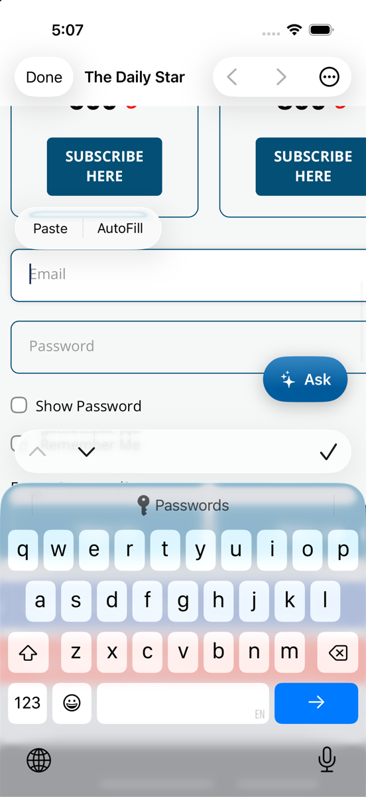
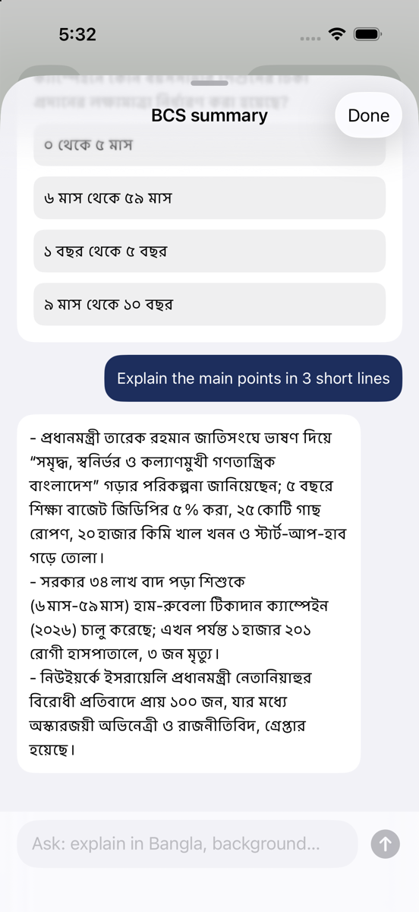
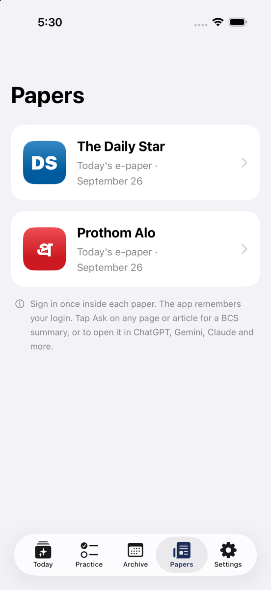

<p align="center">
  
</p>

# NewsDigest

**Daily BCS-focused summaries of The Daily Star and Prothom Alo e-papers.**

Reading two full newspapers every day takes hours. NewsDigest reads them for you each morning and keeps only what matters for the Bangladesh Civil Service (BCS) exam. That means Bangladesh affairs, international affairs, the economy, science and tech, and the environment, with key facts and practice MCQs. Everything runs on free tiers.

> **You need your own e-paper subscriptions.** NewsDigest signs in with your account and only reads papers you already pay for. It stores summaries, never the page images.

## How it works

```
GitHub Actions (06:00, 08:00, 10:00 Dhaka time)
  └─ Playwright signs in to each e-paper with your credentials
  └─ fetches every story's text (headline, body, captions) from the e-paper reader
  └─ Gemini reads the text → BCS-relevant stories, key facts, MCQs
  └─ Groq groups duplicate stories, which are then merged
  └─ saves the digest to Supabase
                     │
                     ▼
        NewsDigest iOS app (SwiftUI)
  Today · Archive · Papers · Settings
```

- **Real article text, not OCR.** Both e-papers serve each story's text to signed-in subscribers. Gemini summarizes that text one page at a time, so numbers, names and dates are copied exactly. The answer comes back as structured JSON: category, headline, bullets, key facts, relevance (high or medium) and page. Each item also keeps the paper's own headline and opening lines, shown as **From the paper**. Reading the page image is only a fallback for pages without text.
- **Model fallback.** If the main Gemini model is overloaded or out of quota, the job tries the next one: `gemini-3.8-flash` → `3.7-flash` → `3.5-flash-lite`.
- **Duplicate merging.** A text-only Groq call lists which stories are the same news. The code then merges them, so the model never writes facts itself.
- **Retries.** Later runs only redo papers that aren't done yet. Failures (expired login, CAPTCHA, edition not out yet) are shown as banners in the app.

## The app

<table>
  <tr>
    <td align="center" width="25%"><br><sub><b>Today</b><br>stories by category, key facts</sub></td>
    <td align="center" width="25%"><br><sub><b>প্রথম আলো in Bangla</b><br>with the paper's own text</sub></td>
    <td align="center" width="25%"><br><sub><b>Practice</b><br>all MCQs, with a score</sub></td>
    <td align="center" width="25%"><br><sub><b>Ask an AI</b><br>ChatGPT, Gemini, Claude, Grok…</sub></td>
  </tr>
  <tr>
    <td align="center" width="25%"><br><sub><b>BCS summary + chat</b><br>ask follow-up questions</sub></td>
    <td align="center" width="25%"><br><sub><b>Archive</b><br>search every past digest</sub></td>
    <td align="center" width="25%"><br><sub><b>Papers</b><br>read the e-papers in-app</sub></td>
    <td width="25%"></td>
  </tr>
</table>

| Tab | What it does |
|---|---|
| **Today** | Today's digest. Step to earlier days with ◀ ▶, swipe, or a calendar. Filter by paper, category or high relevance. Each story shows the paper's own opening lines, opens its page of the e-paper, and has an **Ask** menu (ChatGPT, Gemini, Claude, Grok and more). |
| **Practice** | All of the day's MCQs in one place, with a score. Past days via ◀ ▶ or a calendar. After answering, ask an AI to explain. |
| **Archive** | Every past day, grouped by month. Search across all digests. Bookmarked stories for revision. Days you've opened work offline. |
| **Papers** | Both e-papers in an in-app browser that remembers your login. Tap a story box to open the article. **Ask** gives an instant BCS summary of the page or article, with follow-up chat, or opens it in ChatGPT, Gemini, Claude, Grok and more with the text already filled in. |
| **Settings** | Your digest account, the AI model (Gemini or Groq) and the summary language. No API key is needed on the phone: summaries run through a Supabase Edge Function that holds the keys. |

## Repository layout

```
NewsDigest/                 iOS app (SwiftUI, iOS 17+)
├── Models/                 Paper, digest models
├── Services/               Supabase store, Gemini client, page capture, Keychain
└── Views/                  Today, Archive, Papers/Reader, Summary, Settings
server/                     Daily digest job (Node + TypeScript + Playwright)
├── src/papers/             Daily Star and Prothom Alo scrapers
├── src/gemini.ts           Page summaries with model fallback
├── src/groq.ts             Duplicate grouping (and optional page fallback)
├── src/merge.ts            Merge pages → one digest per paper
└── src/run.ts              Entry point
supabase/schema.sql         Tables + row-level security
.github/workflows/          Scheduled daily job
project.yml                 XcodeGen project definition
```

## Setup

Everything below is free. It takes about 15 minutes.

### 1. Server and daily job

Follow **[server/README.md](server/README.md)**. It covers creating the Supabase project, getting a Gemini API key, adding GitHub secrets, and the first run. In short:

```bash
cd server
npm install
cp .env.example .env                       # fill in your keys and e-paper logins
npm run digest -- --dry --max-pages 2      # local test, writes out/*.json
```

Then add the same values as repository secrets and trigger **Actions → Daily digest → Run workflow**.

### 2. iOS app

```bash
brew install xcodegen
xcodegen generate
open NewsDigest.xcodeproj
```

Run on a simulator or device, then sign in on the **Today** tab with the user you created in Supabase.

The app has this project's Supabase URL and publishable key built in ([`AppConfig.swift`](NewsDigest/AppConfig.swift)). If you run your own copy, change them there or under **Settings → Use a different Supabase project**. Never put the service key in the app.

**Ask → BCS summary** needs the `summarize` Edge Function ([`supabase/functions/summarize`](supabase/functions/summarize/index.ts)): deploy it in Supabase → Edge Functions, and add `GEMINI_API_KEYS` (and optionally `GROQ_API_KEYS`) under Edge Functions → Secrets.

## Configuration

| Variable | Where | Purpose |
|---|---|---|
| `GEMINI_API_KEYS` | secret | One or more comma-separated keys, rotated automatically |
| `GROQ_API_KEYS` | secret | Optional. Used to spot duplicate stories |
| `SUPABASE_URL`, `SUPABASE_SERVICE_ROLE_KEY` | secret | Where digests are saved |
| `DAILYSTAR_EMAIL`, `DAILYSTAR_PASSWORD` | secret | Daily Star e-paper login |
| `PROTHOMALO_EMAIL`, `PROTHOMALO_PASSWORD` | secret | Prothom Alo e-paper login |
| `GEMINI_MODEL`, `GEMINI_FALLBACK_MODELS` | variable | Override the model chain |
| `DIGEST_LANG` | variable | `auto` (default: Daily Star in English, Prothom Alo in Bangla), or force `en`, `bn` or `both` |

## Limitations

- **Summaries can still contain mistakes.** Check key facts against **From the paper** or the page itself (tap **Page N**) before memorizing them. Stories that had to be read from a page image by the lighter model are marked with an orange warning.
- **Scrapers depend on each site's layout.** If a paper redesigns its reader, the job reports "layout not recognized" and logs the new structure for fixing.
- **CAPTCHAs are never bypassed.** If a site shows one, that day's run stops and the app suggests ✨ Summarize instead.
- **Groq isn't used to read pages by default.** Its image model misreads small Bangla print and was seen inventing headlines. Enable it with `GROQ_FALLBACK=true` only if you accept that risk.

## Disclaimer

For personal study only. NewsDigest is not affiliated with The Daily Star or Prothom Alo. Respect their terms of service, and don't redistribute their content or the generated digests.
